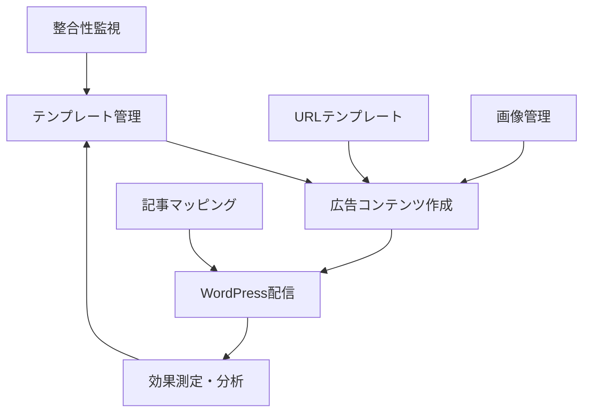
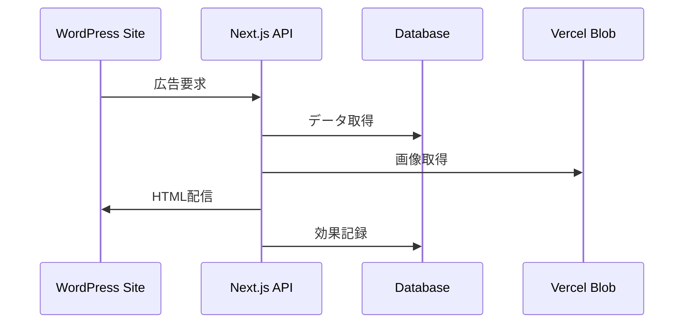

# システムアーキテクチャ

> **関連ドキュメント
**: [要件定義](./requirements.md) | [API仕様](./api-reference.md) | [データベース設計](./database-schema.md)

## プロジェクト構造

```
pj-ado-mvp/
├── src/
│   ├── app/                    # App Router ページ
│   │   ├── api/              # API ルート
│   │   │   ├── auth/[...nextauth]/ # NextAuth API ルート
│   │   │   ├── ad-contents/  # 広告コンテンツ API
│   │   │   │   ├── route.ts  # GET, POST (全広告コンテンツ)
│   │   │   │   └── [id]/route.ts # GET, PUT, DELETE (個別)
│   │   │   ├── templates/    # 広告テンプレート API
│   │   │   │   ├── route.ts  # GET, POST (全テンプレート)
│   │   │   │   ├── [id]/route.ts # GET, PUT, DELETE (個別)
│   │   │   │   ├── import/route.ts # POST (CSVインポート)
│   │   │   │   └── export/route.ts # GET (CSVエクスポート)
│   │   │   ├── upload/       # ファイルアップロード API
│   │   │   │   └── route.ts  # POST (画像アップロード)
│   │   │   ├── integrity-check/ # 整合性チェック API
│   │   │   │   └── route.ts  # GET (システム整合性状況取得)
│   │   │   └── url-templates/ # URLテンプレート API
│   │   │       ├── route.ts  # GET, POST (全URLテンプレート)
│   │   │       ├── [id]/route.ts # GET, PUT, DELETE (個別)
│   │   │       ├── import/route.ts # POST (CSVインポート)
│   │   │       └── export/route.ts # GET (CSVエクスポート)
│   │   ├── dashboard/         # ダッシュボード
│   │   ├── ads/              # 広告コンテンツ管理
│   │   ├── ad-templates/     # 広告テンプレート管理
│   │   ├── url-templates/    # URLテンプレート管理
│   │   ├── article-ad-mapping/ # 記事・広告紐付け管理
│   │   ├── accounts/         # アカウント管理
│   │   ├── login/           # ログインページ
│   │   ├── layout.tsx       # ルートレイアウト
│   │   └── page.tsx         # ホームページ
│   ├── components/           # 共通コンポーネント
│   ├── lib/                 # ユーティリティ・設定
│   ├── auth.config.ts       # NextAuth.js設定詳細
│   ├── auth.ts              # NextAuth.js設定
│   └── middleware.ts        # ルート保護ミドルウェア
└── scripts/               # ユーティリティスクリプト
    └── seed.js           # データベース初期化
```

## 認証・認可システム

### 認証システム

このシステムでは以下の認証機能を実装しています：

- **NextAuth.js v5 (beta)** を使用したクレデンシャル認証
- **ミドルウェア** による全ルート保護 (`/login`以外は認証必須)
- **クライアントサイドセッション管理** でリアルタイムな状態管理
- **bcrypt** によるパスワードハッシュ化
- **セッションベース** の認証フロー
- **条件付きレイアウト** で認証状態に応じた UI 表示

### 役割ベース認可 (RBAC)

システムでは2段階の役割システムを実装：

| 役割               | レベル | 権限                                |
|------------------|-----|-----------------------------------|
| **管理者 (admin)**  | 2   | 全機能アクセス、ユーザー管理、テンプレート管理、広告コンテンツ管理 |
| **編集者 (editor)** | 1   | テンプレート作成・編集、広告コンテンツ管理             |

#### 認可ヘルパー関数

- `hasMinimumRole(user, role)` - 最小権限チェック
- `isAdmin(user)` - 管理者権限チェック
- `canEdit(user)` - 編集権限チェック
- `withAuthorization(handler, requiredRole)` - API認可ラッパー

### アーキテクチャ

- 認証されていないユーザー: ログインフォームのみ表示
- 認証済みユーザー: サイドバー付きメインレイアウト表示
- 役割に応じた機能制限 (アカウント管理は管理者のみ)

## システム全体アーキテクチャ

### アプリケーション層構成

```
┌─────────────────────────────────────────────────────────────┐
│                    クライアント層                              │
│  ┌─────────────────┐  ┌─────────────────┐                     │
│  │   Web Browser   │  │  WordPress Site │                     │
│  │  (管理画面)       │  │  (広告配信)      │                     │
│  └─────────────────┘  └─────────────────┘                     │
└─────────────────────────────────────────────────────────────┘
                              │
┌─────────────────────────────────────────────────────────────┐
│                   プレゼンテーション層                          │
│  ┌─────────────────────────────────────────────────────────┐  │
│  │              Next.js App Router                        │  │
│  │  ┌─────────────┐  ┌─────────────┐  ┌─────────────┐     │  │
│  │  │  Pages      │  │ Components  │  │ Middleware  │     │  │
│  │  │ /dashboard  │  │ Sidebar     │  │ Auth Guard  │     │  │
│  │  │ /templates  │  │ Forms       │  │ Route       │     │  │
│  │  │ /ads        │  │ Modals      │  │ Protection  │     │  │
│  │  └─────────────┘  └─────────────┘  └─────────────┘     │  │
│  └─────────────────────────────────────────────────────────┘  │
└─────────────────────────────────────────────────────────────┘
                              │
┌─────────────────────────────────────────────────────────────┐
│                     API層                                  │
│  ┌─────────────────────────────────────────────────────────┐  │
│  │                API Routes                              │  │
│  │  ┌─────────────┐  ┌─────────────┐  ┌─────────────┐     │  │
│  │  │ /templates  │  │ /delivery   │  │ /upload     │     │  │
│  │  │ CRUD        │  │ Ad Serving  │  │ File Mgmt   │     │  │
│  │  └─────────────┘  └─────────────┘  └─────────────┘     │  │
│  │  ┌─────────────┐  ┌─────────────┐  ┌─────────────┐     │  │
│  │  │ /contents   │  │ /wordpress  │  │ /admin      │     │  │
│  │  │ Ad Mgmt     │  │ Integration │  │ System      │     │  │
│  │  └─────────────┘  └─────────────┘  └─────────────┘     │  │
│  └─────────────────────────────────────────────────────────┘  │
└─────────────────────────────────────────────────────────────┘
                              │
┌─────────────────────────────────────────────────────────────┐
│                   ビジネスロジック層                           │
│  ┌─────────────────────────────────────────────────────────┐  │
│  │              Server Actions & Libraries                │  │
│  │  ┌─────────────┐  ┌─────────────┐  ┌─────────────┐     │  │
│  │  │ template-   │  │ ad-content- │  │ wordpress-  │     │  │
│  │  │ actions.ts  │  │ actions.ts  │  │ sync.ts     │     │  │
│  │  └─────────────┘  └─────────────┘  └─────────────┘     │  │
│  │  ┌─────────────┐  ┌─────────────┐  ┌─────────────┐     │  │
│  │  │ authorization│ │ consistency-│  │ image-      │     │  │
│  │  │ .ts         │  │ checker.ts  │  │ cleanup.ts  │     │  │
│  │  └─────────────┘  └─────────────┘  └─────────────┘     │  │
│  └─────────────────────────────────────────────────────────┘  │
└─────────────────────────────────────────────────────────────┘
                              │
┌─────────────────────────────────────────────────────────────┐
│                    データ永続化層                             │
│  ┌─────────────────┐  ┌─────────────────┐  ┌─────────────────┐ │
│  │  Neon Database  │  │  Vercel Blob    │  │  WordPress DB   │ │
│  │  (PostgreSQL)   │  │  (File Storage) │  │  (External)     │ │
│  │  ・ユーザー       │  │  ・画像ファイル   │  │  ・記事データ    │ │
│  │  ・テンプレート    │  │  ・メタデータ     │  │  ・ショートコード │ │
│  │  ・広告コンテンツ  │  │                │  │                 │ │
│  └─────────────────┘  └─────────────────┘  └─────────────────┘ │
└─────────────────────────────────────────────────────────────┘
```

## 技術スタック詳細

### フロントエンド技術

| 技術                | バージョン  | 用途                          |
|-------------------|--------|-----------------------------|
| **Next.js**       | 15.4.5 | Reactフレームワーク、App Router使用   |
| **React**         | 19.1.0 | UIライブラリ、Server Components活用 |
| **TypeScript**    | 5      | 型安全性、厳格な設定                  |
| **Tailwind CSS**  | v4     | ユーティリティファーストCSS             |
| **Monaco Editor** | Latest | HTMLコードエディター                |
| **Zod**           | 4.0.15 | スキーマバリデーション                 |

### バックエンド・インフラ技術

| 技術                  | 用途                  |
|---------------------|---------------------|
| **NextAuth.js**     | 認証・セッション管理（v5 beta） |
| **Neon PostgreSQL** | メインデータベース（サーバーレス）   |
| **Vercel Blob**     | 画像ファイルストレージ         |
| **bcrypt**          | パスワードハッシュ化          |
| **Vercel Platform** | ホスティング・デプロイメント      |

## データフローアーキテクチャ

### システム全体データフロー



### 広告配信データフロー



## セキュリティアーキテクチャ

### 認証・認可フロー

1. **認証プロセス**
    - ユーザーログイン → NextAuth.js検証 → セッション作成
    - JWTトークンベースのセッション管理
    - ミドルウェアによる全ルート保護

2. **認可レベル**
    - **管理者 (admin)**: 全機能アクセス可能
    - **編集者 (editor)**: コンテンツ作成・編集のみ

3. **APIセキュリティ**
    - 全APIエンドポイントで認証チェック
    - 役割ベース認可（RBAC）実装
    - CORS設定による外部アクセス制御

### データ保護

- **パスワード**: bcryptによるハッシュ化
- **セッション**: secure cookie使用
- **ファイル**: Vercel Blobによる安全な管理
- **データベース**: Neonの暗号化通信

## パフォーマンス最適化

### フロントエンド最適化

- **Server Components**: サーバーサイドレンダリング活用
- **Turbopack**: 高速ビルドシステム
- **コード分割**: ページレベル・コンポーネントレベル
- **画像最適化**: Next.jsの Image コンポーネント

### バックエンド最適化

- **データベースインデックス**: 主要クエリの最適化
- **キャッシュ戦略**: 広告配信で5分間キャッシュ
- **ファイルストレージ**: CDN経由の画像配信
- **自動クリーンアップ**: 不要画像の定期削除

## 監視・運用

### システム監視

- **整合性チェック**: リアルタイムデータ整合性監視
- **エラー追跡**: 構造化ログシステム
- **パフォーマンス**: Vercelの標準監視機能

### 自動化

- **Cron Jobs**: 画像クリーンアップ（週次実行）
- **データ同期**: WordPress連携の自動同期
- **デプロイメント**: Git pushによる自動デプロイ

## 関連ドキュメント

### 詳細仕様・実装ガイド

- **[API仕様書](./api-reference.md)**: 全APIエンドポイントの詳細仕様
- **[データベース設計](./database-schema.md)**: テーブル構造とリレーション
- **[WordPress統合](./wordpress-plugin-implementation.md)**: プラグイン実装ガイド

### 機能別ドキュメント

- **[テンプレートシステム](./features/templates.md)**: 広告・URLテンプレート機能
- **[広告管理・配信](./features/ad-management.md)**: コンテンツ管理・配信システム
- **[WordPress統合](./features/wordpress-integration.md)**: 統合システム概要

### 運用・開発ガイド

- **[トラブルシューティング](./troubleshooting.md)**: 問題解決ガイド
