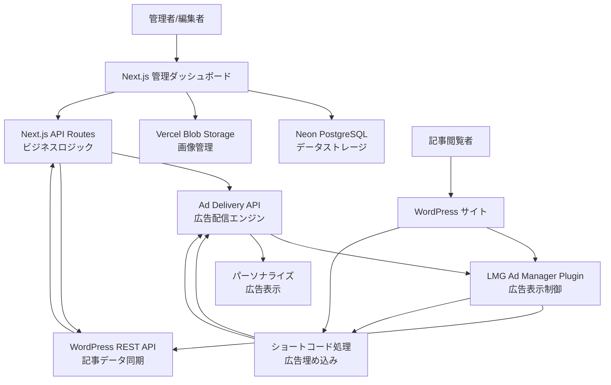

# 次世代広告管理システム：Next.js × WordPress統合による革新的広告配信プラットフォーム

## はじめに

デジタル広告の世界では、コンテンツ管理の複雑化とパフォーマンス追跡の重要性が年々増しています。従来の広告管理システムでは、テンプレートの管理、配信の最適化、パフォーマンス分析が分散しており、運用効率に大きな課題がありました。

LMGが開発したこの次世代広告管理システムは、これらの課題を根本的に解決するため、最新のWeb技術スタックを活用した統合型アーキテクチャを採用しています。本記事では、その技術的詳細と実装の背景にある設計思想について詳しく解説します。

## システム開発の背景と課題

### 従来システムの問題点

**1. 管理の分散化**
従来のLMGの広告運用では、広告テンプレートの管理、配信設定、パフォーマンス分析が異なるツールに散在していました。これにより、広告キャンペーンの作成から分析まで、複数のシステムを横断する必要があり、作業効率が大幅に低下していました。

**2. テンプレート管理の複雑性**
PORTキャリアをはじめとする内部メディアでは、記事の内容に応じて動的に広告内容を変更する必要がありました。しかし、既存システムでは静的な広告しか対応できず、パーソナライゼーションや動的コンテンツの実現が困難でした。

**3. パフォーマンス追跡の限界**
広告のインプレッション数やクリック率の測定は可能でしたが、リアルタイムでの分析や、記事単位での詳細な効果測定ができませんでした。これにより、効果的な広告配置や最適化の判断が困難でした。

**4. WordPress統合の課題**
LMGの主力メディアであるPORTキャリアはWordPressベースで運営されており、広告システムとの連携が技術的に複雑でした。手動での広告コード埋め込みや、記事更新時の広告同期などが大きな運用負荷となっていました。

### 新システムで解決する課題

**統合管理プラットフォームの実現**
Next.js 15をベースとした単一のダッシュボードで、広告テンプレートの作成から配信、分析まで一元管理を可能にします。これにより、広告運用の効率を大幅に向上させ、人的リソースをより戦略的な業務に集中できるようになります。

**動的コンテンツ配信システム**
テンプレートベースの広告生成システムにより、記事の内容や読者の属性に応じて動的に広告内容を変更できます。プレースホルダーシステムを活用することで、一つのテンプレートから無数のバリエーションを生成可能です。

**リアルタイム分析基盤**
広告配信と同時にインプレッション・クリックデータを収集し、リアルタイムでのパフォーマンス分析を実現します。これにより、効果の低い広告の即座な改善や、高パフォーマンス広告の横展開が可能になります。

**WordPress完全統合**
専用プラグインによる無縫な連携により、WordPressサイトでの広告表示を自動化します。記事作成者は簡単なショートコードを記述するだけで、適切な広告を表示でき、技術的な知識は不要です。

## システム全体アーキテクチャの詳細解説

### アーキテクチャ設計の基本方針

このシステムは、以下の設計原則に基づいて構築されています：

**1. マイクロサービス志向**
各機能を独立したサービスとして分離し、API経由で連携させることで、個別の機能拡張や保守を容易にしています。広告配信、テンプレート管理、分析機能など、それぞれが独立して動作し、障害の局所化を実現しています。

**2. API ファーストアプローチ**
すべての機能をREST APIとして提供することで、WordPress以外のCMSやフロントエンドシステムとの連携も将来的に可能にしています。これにより、システムの拡張性と再利用性を大幅に向上させています。

**3. セキュリティ・バイ・デザイン**
システムの設計段階からセキュリティを考慮し、認証・認可、入力値検証、CORS設定など、多層防御アプローチを採用しています。

**4. パフォーマンス最優先**
広告配信は「速度が命」のため、多層キャッシュシステムやCDN活用により、ミリ秒単位でのレスポンス最適化を実現しています。

### システム全体像と相互関係

システム全体は大きく3つの主要コンポーネントで構成されています：

**1. Next.js管理システム（広告管理の中枢）**
管理者と編集者が広告テンプレート、URLテンプレート、広告コンテンツを管理する統合ダッシュボードです。ここですべての広告リソースが作成・管理され、配信設定やパフォーマンス分析も行われます。

**2. WordPress統合プラグイン（コンテンツ配信の架け橋）**
WordPressサイトに広告を表示するための専用プラグインです。記事作成者が簡単なショートコードを記述すると、Next.jsシステムから適切な広告コンテンツを取得して表示します。

**3. 配信・分析システム（パフォーマンスの最適化）**
実際の広告配信とインプレッション・クリック分析を担当します。リアルタイムでのデータ収集により、広告効果の測定と最適化を継続的に実行します。

### コンポーネント間の通信フロー



この図が示すように、システムは双方向の通信により密接に連携しています。WordPressから記事情報がNext.jsシステムに同期され、一方でNext.jsから配信される広告がWordPressサイトで表示される仕組みです。

### 技術スタック選定の理由と詳細

#### Next.js管理システムの技術構成

**Next.js 15.4.5（フレームワークの中核）**
Next.js 15を選択した理由は、App Routerによる最新のルーティングシステムとサーバーコンポーネントの恩恵を受けるためです。従来のPages
Routerと比較して、App Routerはより直感的なファイル構造を提供し、サーバーサイドレンダリング（SSR）とスタティック生成（SSG）の使い分けが容易になります。

特に広告管理システムでは、管理画面のSEO最適化は不要な一方で、高速なページ遷移と豊富な状態管理が求められます。Next.js
15のサーバーコンポーネント機能により、データベースアクセスをサーバーサイドで完結させ、クライアントサイドの処理を最小限に抑えることができます。

**React 19（UIライブラリの最新版）**
React 19では、Suspenseの改善やServer
Actionsの正式対応など、サーバーサイド処理との連携が大幅に強化されました。広告管理システムでは、テンプレート編集やファイルアップロードなど、サーバーとの頻繁なデータ交換が発生するため、これらの機能を活用することで、より滑らかなユーザー体験を実現しています。

**TypeScript 5（型安全性とDX向上）**
大規模なシステム開発において、型安全性は保守性と開発効率に直結します。特に広告システムでは、テンプレートデータ、URLパラメータ、画像メタデータなど、複雑なデータ構造を扱うため、TypeScriptの恩恵は計り知れません。

プロジェクト全体で厳格な型定義（`strict: true`）を適用し、`@/*`
パスエイリアスによる明確なモジュール構造を構築しています。これにより、新しい開発者でも迷いなくコードを理解し、拡張できる環境を整えています。

**NextAuth.js 5.0.0-beta.29（認証システムの選択）**
従来のNextAuth.js
v4からv5への移行により、より柔軟な認証フローとセッション管理が可能になりました。広告管理システムでは、管理者（admin）と編集者（editor）の2段階権限制御が必要で、v5の改善された認可システムがこの要求に完璧に対応しています。

特に重要なのは、サーバーアクション内での認証状態取得が簡素化されたことです。これにより、API
Routes以外でも簡単に権限チェックを実装でき、セキュリティホールの発生リスクを大幅に軽減しています。

**Tailwind CSS v4（スタイリング戦略）**
Tailwind CSS v4では、Lightning CSS engineによる高速化とネイティブCSS Cascading
Layersサポートが追加されました。広告管理システムの管理画面では、データテーブル、フォーム、モーダルなど、複雑なUIコンポーネントが多数存在するため、Tailwindの
utility-first アプローチが開発速度と保守性の両立を実現しています。

カスタムカラーパレット（グレー・ブルー基調）を定義し、ダークモード対応も見据えた設計になっています。

**Neon PostgreSQL（データベース選択の背景）**
サーバーレス環境での PostgreSQL データベースとして Neon を選択しました。従来のRDSと比較して、以下の利点があります：

1. **コールドスタート時間の短縮**: サーバーレス関数からのデータベース接続が高速
2. **自動スケーリング**: トラフィック変動に応じた自動的なリソース調整
3. **コスト最適化**: 使用した分だけの従量課金

広告配信システムでは、トラフィックの変動が激しいため、従来の固定リソース型データベースでは無駄なコストが発生していました。Neonにより、この問題を解決しています。

**Vercel Blob（ファイルストレージ戦略）**
広告に使用する画像ファイルの管理には、Vercel
Blobを採用しました。S3などの従来のオブジェクトストレージと比較して、Vercelエコシステムとの親和性と、グローバルCDNによる高速配信が決定要因です。

自動画像最適化機能により、WebP/AVIFフォーマットへの変換や、デバイスに応じたリサイズも自動実行されるため、広告表示速度の最適化に大きく貢献しています。

**Monaco Editor（HTMLエディター選択）**
広告テンプレートのHTMLを編集するため、Visual Studio Codeでも使用されているMonaco
Editorを統合しています。構文ハイライト、自動補完、エラー検出などの機能により、HTMLの記述ミスを大幅に軽減できます。

特に重要なのは、プレースホルダー（`{{variable}}`形式）の専用ハイライト機能を実装していることです。これにより、テンプレート作成時のミスを視覚的に防止できます。

#### WordPressプラグインの技術構成

**PHP 7.4+（後方互換性と新機能のバランス）**
WordPressの最低要件との兼ね合いで PHP 7.4 を最低バージョンとしていますが、PHP 8.x
の新機能（型宣言の改善、match式、nullsafe演算子など）も活用可能な設計にしています。

プラグインアーキテクチャは、シングルトンパターンを採用し、WordPressのライフサイクルに合わせた適切な初期化を実現しています。

**WordPress REST API（データ同期の中核）**
WordPress REST APIを拡張し、独自エンドポイント（`/wp-json/lmg-ad-manager/v1/`）を構築しています。これにより、記事情報と広告使用状況データを
JSON形式でNext.jsシステムと効率的に交換できます。

特徴的なのは、ショートコードの使用状況を自動分析し、どの記事でどの広告が使用されているかをリアルタイムで追跡する機能です。これにより、広告の利用状況を正確に把握し、効果測定の精度を向上させています。

**WordPress Shortcode API（シンプルかつ強力な埋め込み機能）**
記事作成者が`[lmg_ad id="123"]`という形式で広告を埋め込むだけで、複雑な広告配信システムを利用できます。ショートコードAPIの拡張により、以下のオプション機能も提供しています：

- `cache="3600"`: キャッシュ時間の個別設定
- `debug="true"`: デバッグ情報の表示
- `class="custom-ad"`: CSSクラスのカスタマイズ
- `width="300px"`: 表示サイズの制御

**WP HTTP API（堅牢な外部通信）**
Next.js APIとの通信には、WordPressの標準WP HTTP APIを使用しています。独自のHTTPクライアントと比較して、以下の利点があります：

1. **セキュリティ**: SSL証明書検証やタイムアウト処理が標準実装
2. **互換性**: 様々なサーバー環境での動作保証
3. **キャッシュ**: WordPressの内蔵キャッシュシステムとの連携

**WordPress Cache API（パフォーマンス最適化）**
広告データのキャッシュには、WordPress Transients APIを活用しています。これにより、Redis やMemcached
などの外部キャッシュシステムに依存せず、WordPressの標準機能だけで効果的なキャッシュシステムを構築しています。

キャッシュキーの設計では、広告IDに基づくハッシュ値を使用し、キャッシュヒット率の最適化を図っています。

## データベース設計の詳細解説

### 設計思想とリレーショナルモデル

このシステムのデータベース設計は、以下の原則に基づいて構築されています：

**1. 正規化とパフォーマンスのバランス**
第3正規形を基本としつつ、広告配信時のパフォーマンスを考慮して、適切な非正規化も取り入れています。例えば、`ad_contents`テーブルには
`impressions`と`clicks`カウンタを直接格納し、リアルタイム更新を効率化しています。

**2. 拡張性を考慮した設計**
将来的な機能拡張（A/Bテスト、地域別配信など）を見据えて、柔軟なJSONカラム（`content_data`
）を活用しています。これにより、スキーマ変更を最小限に抑えながら機能追加が可能です。

**3. 参照整合性の保証**
外部キー制約を適切に設定し、CASCADE DELETEやSET NULLにより、データの整合性を自動的に維持しています。

### PostgreSQL スキーマ詳細

#### ユーザー管理テーブル (users)

```sql
CREATE TABLE users
(
    id         SERIAL PRIMARY KEY,
    name       VARCHAR(255)                 NOT NULL,
    email      VARCHAR(255) UNIQUE          NOT NULL,
    password   VARCHAR(255)                 NOT NULL, -- bcrypt ハッシュ化
    role       VARCHAR(20) DEFAULT 'editor' NOT NULL, -- 'admin' or 'editor'
    created_at TIMESTAMP   DEFAULT NOW(),
    updated_at TIMESTAMP   DEFAULT NOW()
);
```

**設計の特徴：**

- **役割ベースアクセス制御**: `role`カラムで管理者（admin）と編集者（editor）を区別
- **セキュリティ**: パスワードはbcryptでハッシュ化、saltラウンド数は10
- **ユニーク制約**: `email`カラムにユニーク制約を設定し、重複登録を防止
- **インデックス**: `role`カラムにインデックスを作成し、権限チェックを高速化

#### 広告テンプレート管理テーブル (ad_templates)

```sql
CREATE TABLE ad_templates
(
    id          SERIAL PRIMARY KEY,
    name        VARCHAR(255) NOT NULL,
    html        TEXT         NOT NULL, -- HTMLテンプレート（プレースホルダー含む）
    description TEXT,
    created_at  TIMESTAMP DEFAULT NOW(),
    updated_at  TIMESTAMP DEFAULT NOW()
);
```

**設計の特徴：**

- **プレースホルダーシステム**: `html`カラムに`{{variable}}`形式のプレースホルダーを含むHTMLを格納
- **無制限HTML**: `TEXT`型により、複雑な広告レイアウトにも対応
- **テンプレート再利用**: 一つのテンプレートから複数の広告コンテンツを生成可能

プレースホルダーの例：

```html

<div class="ad-banner">
  <h2>{{title}}</h2>
  
  <a href="{{link}}">{{button_text}}</a>
</div>
```

#### URLテンプレート管理テーブル (url_templates)

```sql
CREATE TABLE url_templates
(
    id           SERIAL PRIMARY KEY,
    name         VARCHAR(255) NOT NULL,
    url_template TEXT         NOT NULL, -- UTMパラメータ付きURLテンプレート
    description  TEXT,
    created_at   TIMESTAMP DEFAULT NOW(),
    updated_at   TIMESTAMP DEFAULT NOW()
);
```

**設計の特徴：**

- **UTM追跡対応**: Google Analyticsなどでのキャンペーン追跡を標準サポート
- **動的パラメータ**: URLテンプレート内でもプレースホルダーを使用可能
- **カスタムパラメータ**: JSON形式でのカスタム追跡パラメータをサポート

URLテンプレートの例：

```
https://example.com/{{campaign_path}}?utm_source={{source}}&utm_medium=banner&utm_campaign={{campaign_name}}
```

#### 広告コンテンツテーブル (ad_contents) - システムの中核

```sql
CREATE TABLE ad_contents
(
    id              SERIAL PRIMARY KEY,
    name            VARCHAR(255) NOT NULL,
    template_id     INTEGER REFERENCES ad_templates (id) ON DELETE CASCADE,
    url_template_id INTEGER REFERENCES url_templates (id) ON DELETE CASCADE,
    content_data    JSON        DEFAULT '{}',    -- プレースホルダーの実際の値
    status          VARCHAR(20) DEFAULT 'draft', -- draft, active, paused, archived
    created_by      INTEGER      REFERENCES users (id) ON DELETE SET NULL,
    impressions     INTEGER     DEFAULT 0,       -- 表示回数カウンタ
    clicks          INTEGER     DEFAULT 0,       -- クリック回数カウンタ
    created_at      TIMESTAMP   DEFAULT NOW(),
    updated_at      TIMESTAMP   DEFAULT NOW()
);
```

**設計の特徴：**

- **テンプレートとの分離**: `template_id`により、デザインとコンテンツを分離管理
- **柔軟なデータ格納**: `content_data`のJSONカラムで、任意のプレースホルダーデータを格納
- **ステータス管理**: 4段階のステータス（下書き、アクティブ、停止、アーカイブ）
- **リアルタイム分析**: インプレッション・クリック数の直接格納によるパフォーマンス分析
- **作成者追跡**: 監査ログとしての作成者情報保持

`content_data`のJSONスキーマ例：

```json
{
  "title": "転職成功率96%！業界最高峰のサポート",
  "image": "https://blob.vercel-storage.com/career-banner-abc123.jpg",
  "button_text": "無料相談はこちら",
  "campaign_name": "spring2024",
  "source": "port_career",
  "campaign_path": "career/consultation"
}
```

#### 画像管理テーブル (ad_images)

```sql
CREATE TABLE ad_images
(
    id                SERIAL PRIMARY KEY,
    ad_content_id     INTEGER REFERENCES ad_contents (id) ON DELETE CASCADE,
    blob_url          VARCHAR(500) NOT NULL, -- Vercel Blob URL
    original_filename VARCHAR(255),
    file_size         INTEGER,
    mime_type         VARCHAR(100),
    alt_text          VARCHAR(255),
    placeholder_name  VARCHAR(100),          -- テンプレート内のプレースホルダー名
    created_at        TIMESTAMP DEFAULT NOW()
);
```

**設計の特徴：**

- **Vercel Blob統合**: `blob_url`にVercel BlobのCDN URLを格納
- **メタデータ管理**: ファイルサイズ、MIME type、元ファイル名の保持
- **プレースホルダー連携**: `placeholder_name`によりテンプレート内の位置を特定
- **アクセシビリティ**: `alt_text`による画像説明文の管理

#### WordPress統合テーブル (article_ad_mappings)

```sql
CREATE TABLE article_ad_mappings
(
    id         SERIAL PRIMARY KEY,
    post_id    INTEGER     NOT NULL,    -- WordPressの投稿ID
    post_title VARCHAR(255),
    post_url   TEXT,
    ad_id      VARCHAR(50) NOT NULL,    -- 使用されている広告のID
    synced_at  TIMESTAMP DEFAULT NOW(), -- 最終同期時刻
    created_at TIMESTAMP DEFAULT NOW(),
    updated_at TIMESTAMP DEFAULT NOW(),
    UNIQUE (post_id, ad_id)             -- 重複防止制約
);
```

**設計の特徴：**

- **双方向同期**: WordPressとNext.jsシステム間でのデータ同期を管理
- **重複防止**: 同一記事での同一広告の重複記録を防止
- **同期追跡**: `synced_at`により、データの鮮度を管理
- **記事メタデータ**: タイトルとURLの保持により、管理画面での視認性を向上

### インデックス戦略とパフォーマンス最適化

#### パフォーマンス重視のインデックス設計

```sql
-- 権限チェック最適化
CREATE INDEX idx_users_role ON users (role);

-- 広告配信最適化
CREATE INDEX idx_ad_contents_status ON ad_contents (status);
CREATE INDEX idx_ad_contents_template_id ON ad_contents (template_id);
CREATE INDEX idx_ad_contents_url_template_id ON ad_contents (url_template_id);

-- 作成者別検索最適化
CREATE INDEX idx_ad_contents_created_by ON ad_contents (created_by);

-- 画像関連最適化
CREATE INDEX idx_ad_images_ad_content_id ON ad_images (ad_content_id);

-- WordPress同期最適化
CREATE INDEX idx_article_ad_mappings_post_id ON article_ad_mappings (post_id);
CREATE INDEX idx_article_ad_mappings_ad_id ON article_ad_mappings (ad_id);
```

**インデックス設計の考慮点：**

1. **頻繁なクエリの特定**: 広告配信時の`status = 'active'`フィルタリング
2. **結合クエリの最適化**: テンプレート関連テーブルとの結合性能向上
3. **範囲検索の効率化**: 作成日時や更新日時での検索最適化
4. **ユニーク制約とのバランス**: データ整合性とパフォーマンスの両立

### データベース運用とメンテナンス

#### 自動化されたメンテナンス機能

**1. 画像クリーンアップシステム**

```sql
-- 孤立した画像の検出クエリ
SELECT ai.*
FROM ad_images ai
         LEFT JOIN ad_contents ac ON ai.ad_content_id = ac.id
WHERE ac.id IS NULL;
```

定期的（週次）に実行される自動クリーンアップにより、使用されなくなった画像ファイルを自動削除し、ストレージコストを最適化しています。

**2. パフォーマンス分析のための集計テーブル**
将来的には、日次・月次のパフォーマンス分析のために集計テーブルの追加も検討されています：

```sql
-- 将来の拡張例
CREATE TABLE ad_performance_daily
(
    date          DATE,
    ad_content_id INTEGER REFERENCES ad_contents (id),
    impressions   INTEGER,
    clicks        INTEGER,
    ctr           DECIMAL(5, 4), -- Click Through Rate
    PRIMARY KEY (date, ad_content_id)
);
```

この設計により、リアルタイム分析とバッチ分析の両方に対応できる柔軟なデータ基盤を構築しています。

## Next.js 管理システム詳細

### API エンドポイント設計

#### 1. 広告配信API (`/api/delivery/[id]`)

**機能**: 広告コンテンツの配信とインプレッション追跡

**実装詳細**:

```typescript
export async function GET(
  request: NextRequest,
  {params}: { params: Promise<Params> }
) {
  try {
    const {id} = await params;
    const contentId = parseInt(id);

    // 広告コンテンツを取得
    const content = await getAdContentById(contentId);

    // アクティブな広告コンテンツのみ配信
    if (content.status !== 'active') {
      return NextResponse.json(
        {error: '広告コンテンツが非アクティブです'},
        {status: 403}
      );
    }

    // インプレッション数を増加
    await trackImpression(contentId);

    // HTMLテンプレートのプレースホルダーを置換
    let html = processTemplate(content);

    // クリック追跡のためのリンク自動変換
    html = convertLinksToTracking(html, contentId);

    // CORS対応のレスポンス
    const response = NextResponse.json({html, ...metadata});
    response.headers.set('Access-Control-Allow-Origin', '*');
    response.headers.set('Cache-Control', 'public, max-age=300');

    return response;
  } catch (error) {
    return NextResponse.json(
      {error: '配信エラーが発生しました'},
      {status: 500}
    );
  }
}
```

**特徴**:

- プレースホルダー `{{variable}}` の動的置換
- 自動リンク追跡変換
- CORS対応
- 5分間のキャッシュ設定
- インプレッション自動追跡

#### 2. WordPress同期API (`/api/wordpress/sync`)

**機能**: WordPressサイトから記事・広告使用状況データを同期

**実装詳細**:

```typescript
export async function POST() {
  // 認証チェック（admin/editor権限必須）
  const session = await auth();
  if (!hasMinimumRole(session.user, 'editor')) {
    return NextResponse.json({error: '権限がありません'}, {status: 403});
  }

  // WordPress APIから最新データを取得
  const data = await fetchWordPressMappings();

  // ローカルDBに同期
  const result = await syncWordPressMappings(data);

  return NextResponse.json({
    message: 'WordPress同期が完了しました',
    result: {
      inserted: result.inserted,
      updated: result.updated,
      deleted: result.deleted
    }
  });
}
```

### 認証・認可システム

#### NextAuth.js設定

```typescript
// src/auth.config.ts
export default {
  providers: [
    Credentials({
      credentials: {
        email: {label: "Email", type: "email"},
        password: {label: "Password", type: "password"}
      },
      async authorize(credentials) {
        const user = await getUserByEmail(credentials.email);
        if (user && await bcrypt.compare(credentials.password, user.password)) {
          return {
            id: user.id.toString(),
            email: user.email,
            name: user.name,
            role: user.role
          };
        }
        return null;
      },
    })
  ],
} satisfies NextAuthConfig;
```

#### 役割ベースアクセス制御

```typescript
// src/lib/authorization.ts
export function hasMinimumRole(userRole: string, requiredRole: string): boolean {
  const roleLevels = {editor: 1, admin: 2};
  return roleLevels[userRole] >= roleLevels[requiredRole];
}

export function withAuthorization(requiredRole: string) {
  return async (request: NextRequest) => {
    const session = await auth();
    if (!session?.user || !hasMinimumRole(session.user.role, requiredRole)) {
      return NextResponse.json({error: '権限がありません'}, {status: 403});
    }
  };
}
```

### テンプレートシステム

#### HTMLテンプレート処理

**プレースホルダー抽出**:

```typescript
// src/lib/template-utils/placeholder-extraction.ts
export function extractPlaceholders(html: string): string[] {
  const placeholderRegex = /\{\{\s*([a-zA-Z_][a-zA-Z0-9_]*)\s*\}\}/g;
  const placeholders: string[] = [];
  let match;

  while ((match = placeholderRegex.exec(html)) !== null) {
    if (!placeholders.includes(match[1])) {
      placeholders.push(match[1]);
    }
  }

  return placeholders;
}
```

**リンク処理**:

```typescript
// src/lib/template-utils/link-processing.ts
export function enforceNofollowLinks(html: string): string {
  return html.replace(
    /<a\s+([^>]*?)href\s*=\s*["']([^"']+)["']([^>]*?)>/gi,
    (match, beforeHref, url, afterHref) => {
      if (url.startsWith('http') && !url.includes(process.env.NEXT_PUBLIC_APP_URL)) {
        const relMatch = afterHref.match(/rel\s*=\s*["']([^"']*)["']/i);
        if (relMatch) {
          const existingRel = relMatch[1];
          if (!existingRel.includes('nofollow')) {
            afterHref = afterHref.replace(
              /rel\s*=\s*["']([^"']*)["']/i,
              `rel="${existingRel} nofollow"`
            );
          }
        } else {
          afterHref += ' rel="nofollow"';
        }
      }
      return `<a ${beforeHref}href="${url}"${afterHref}>`;
    }
  );
}
```

## WordPress プラグイン詳細

### プラグイン構造

```
lmg-ad-manager/
├── lmg-ad-manager.php          # メインプラグインファイル
├── includes/
│   ├── class-lmg-ad-shortcode.php      # ショートコード処理
│   ├── class-lmg-ad-api-client.php     # API通信クライアント
│   ├── class-lmg-ad-cache.php          # キャッシュ管理
│   └── class-lmg-ad-rest-api.php       # REST API エンドポイント
├── admin/
│   └── class-lmg-ad-admin.php          # 管理画面
└── assets/
    ├── css/
    └── js/
        └── lmg-ad-tracker.js           # クリック追跡JS
```

### ショートコードシステム

#### 基本的な使用法

```php
[lmg_ad id="123"]
[lmg_ad id="123" cache="3600" class="custom-ad" width="300px" debug="true"]
```

#### ショートコード処理の実装

```php
// includes/class-lmg-ad-shortcode.php
public function render_ad($atts) {
    // 属性のサニタイズとマージ
    $atts = shortcode_atts(array(
        'id' => '',
        'cache' => '',
        'class' => 'lmg-ad-container',
        'width' => '',
        'height' => '',
        'debug' => ''
    ), $atts, 'lmg_ad');
    
    $ad_id = sanitize_text_field($atts['id']);
    
    if (empty($ad_id)) {
        return $this->render_error_message('広告IDが指定されていません。');
    }
    
    // キャッシュから取得を試行
    $cached_html = LMG_Ad_Cache::get($ad_id);
    if ($cached_html !== false && !$this->is_debug_mode($atts['debug'])) {
        return $this->wrap_ad_html($cached_html, $atts, true);
    }
    
    // API から広告データを取得
    $api_client = new LMG_Ad_API_Client();
    $ad_data = $api_client->get_ad_data($ad_id);
    
    if (!$ad_data || !isset($ad_data['html'])) {
        return $this->render_error_message('広告データの取得に失敗しました。');
    }
    
    // HTMLをサニタイズ
    $ad_html = wp_kses($ad_data['html'], $this->get_allowed_html_tags());
    
    // キャッシュに保存
    LMG_Ad_Cache::set($ad_id, $ad_html, $this->get_cache_time($atts['cache']));
    
    return $this->wrap_ad_html($ad_html, $atts, false);
}
```

### API通信クライアント

#### Next.js API との通信

```php
// includes/class-lmg-ad-api-client.php
public function get_ad_data($ad_code) {
    if (empty($ad_code)) {
        throw new Exception('広告コードが指定されていません。');
    }
    
    $url = $this->build_api_url($ad_code);
    $response = $this->make_request($url);
    
    return $this->parse_response($response);
}

private function make_request($url, $method = 'GET', $data = null, $blocking = true) {
    $args = array(
        'method' => strtoupper($method),
        'timeout' => $this->timeout,
        'blocking' => $blocking,
        'headers' => array(
            'User-Agent' => 'LMG-Ad-Manager/' . LMG_AD_MANAGER_VERSION,
            'Accept' => 'application/json',
            'Cache-Control' => 'no-cache'
        ),
        'sslverify' => true
    );
    
    if ($data !== null && $method === 'POST') {
        $args['headers']['Content-Type'] = 'application/json';
        $args['body'] = json_encode($data);
    }
    
    $response = wp_remote_request($url, $args);
    
    if (is_wp_error($response)) {
        throw new Exception("API通信エラー: " . $response->get_error_message());
    }
    
    return $response;
}
```

### WordPress REST API エンドポイント

#### ショートコード使用状況API

```php
// includes/class-lmg-ad-rest-api.php
public function register_routes() {
    register_rest_route('lmg-ad-manager/v1', '/shortcode-usage', array(
        'methods' => 'GET',
        'callback' => array($this, 'get_shortcode_usage'),
    ));
}

public function get_shortcode_usage($request) {
    global $wpdb;
    
    // [lmg_ad]ショートコードを含む公開記事を取得
    $posts = $wpdb->get_results("
        SELECT ID, post_title, post_name, post_type, post_content 
        FROM {$wpdb->posts} 
        WHERE post_status = 'publish' 
        AND post_content LIKE '%[lmg_ad%'
        ORDER BY post_date DESC
    ");
    
    $shortcode_data = array();
    
    foreach ($posts as $post) {
        preg_match_all('/\[lmg_ad[^\]]*\]/', $post->post_content, $matches);
        
        foreach ($matches[0] as $shortcode) {
            // id属性を抽出
            preg_match('/id="([^"]+)"/', $shortcode, $id_match);
            $ad_id = $id_match[1] ?? 'unknown';
            
            if (!isset($shortcode_data[$ad_id])) {
                $shortcode_data[$ad_id] = array(
                    'ad_id' => $ad_id,
                    'count' => 0,
                    'posts' => array()
                );
            }
            
            $shortcode_data[$ad_id]['count']++;
            $shortcode_data[$ad_id]['posts'][] = array(
                'id' => $post->ID,
                'title' => $post->post_title,
                'url' => get_permalink($post->ID)
            );
        }
    }
    
    return array(
        'shortcodes' => array_values($shortcode_data)
    );
}
```

## データ同期システム

### WordPress → Next.js 同期フロー

1. **管理画面での同期トリガー**: 管理者またはエディターが手動で同期を実行
2. **WordPress REST API 呼び出し**: Next.js が WordPress の REST API エンドポイントを呼び出し
3. **データ取得**: WordPress サイトから記事情報と広告使用状況を取得
4. **データ変換・検証**: 取得したデータを Next.js の形式に変換
5. **データベース更新**: PostgreSQL の `article_ad_mappings` テーブルを更新
6. **結果レポート**: 同期結果（追加・更新・削除件数）をレスポンス

### 同期処理の詳細実装

```typescript
// src/lib/wordpress-sync-actions.ts
export async function syncWordPressMappings(data: WordPressMappingData) {
  const db = neon(process.env.DATABASE_URL!);

  let inserted = 0;
  let updated = 0;
  let deleted = 0;
  const errors: string[] = [];

  try {
    // 既存データを取得
    const existingMappings = await db`
      SELECT post_id, ad_id, synced_at 
      FROM article_ad_mappings
    `;

    const existingMap = new Map();
    existingMappings.forEach(mapping => {
      const key = `${mapping.post_id}-${mapping.ad_id}`;
      existingMap.set(key, mapping);
    });

    // 新しいデータを処理
    for (const shortcode of data.shortcodes) {
      for (const post of shortcode.posts) {
        const key = `${post.id}-${shortcode.ad_id}`;

        if (existingMap.has(key)) {
          // 既存データを更新
          await db`
            UPDATE article_ad_mappings 
            SET post_title = ${post.title},
                post_url = ${post.url},
                synced_at = NOW(),
                updated_at = NOW()
            WHERE post_id = ${post.id} AND ad_id = ${shortcode.ad_id}
          `;
          updated++;
          existingMap.delete(key);
        } else {
          // 新しいデータを挿入
          await db`
            INSERT INTO article_ad_mappings 
            (post_id, post_title, post_url, ad_id, synced_at)
            VALUES (${post.id}, ${post.title}, ${post.url}, ${shortcode.ad_id}, NOW())
          `;
          inserted++;
        }
      }
    }

    // 残った既存データは削除対象
    for (const [key, mapping] of existingMap) {
      await db`
        DELETE FROM article_ad_mappings 
        WHERE post_id = ${mapping.post_id} AND ad_id = ${mapping.ad_id}
      `;
      deleted++;
    }

    return {
      success: true,
      inserted,
      updated,
      deleted,
      errors
    };

  } catch (error) {
    logger.error('同期処理エラー:', error);
    return {
      success: false,
      inserted: 0,
      updated: 0,
      deleted: 0,
      errors: [error instanceof Error ? error.message : 'Unknown error']
    };
  }
}
```

## パフォーマンス最適化

### キャッシュ戦略

#### WordPress側キャッシュ

```php
// includes/class-lmg-ad-cache.php
class LMG_Ad_Cache {
    
    public static function get($key) {
        return get_transient(self::get_cache_key($key));
    }
    
    public static function set($key, $data, $expiration = 3600) {
        return set_transient(self::get_cache_key($key), $data, $expiration);
    }
    
    public static function delete($key) {
        return delete_transient(self::get_cache_key($key));
    }
    
    private static function get_cache_key($key) {
        return 'lmg_ad_' . md5($key);
    }
}
```

#### Next.js側キャッシュ

- **静的キャッシュ**: 配信API レスポンスに `Cache-Control: public, max-age=300` 設定
- **データベースクエリキャッシュ**: React Server Components の自動キャッシュを活用
- **画像キャッシュ**: Vercel Blob の CDN キャッシュを利用

### データベースインデックス最適化

```sql
-- パフォーマンス向上のためのインデックス
CREATE INDEX idx_ad_contents_template_id ON ad_contents (template_id);
CREATE INDEX idx_ad_contents_url_template_id ON ad_contents (url_template_id);
CREATE INDEX idx_ad_contents_status ON ad_contents (status);
CREATE INDEX idx_ad_images_ad_content_id ON ad_images (ad_content_id);
CREATE INDEX idx_article_ad_mappings_post_id ON article_ad_mappings (post_id);
CREATE INDEX idx_article_ad_mappings_ad_id ON article_ad_mappings (ad_id);
```

## セキュリティ対策

### 入力値検証・サニタイゼーション

#### Next.js側

```typescript
// Zodスキーマによる入力検証
const AdContentSchema = z.object({
  name: z.string().min(1).max(255),
  template_id: z.number().int().positive(),
  content_data: z.record(z.string()),
  status: z.enum(['draft', 'active', 'paused', 'archived'])
});
```

#### WordPress側

```php
// WordPressの標準関数を使用
$ad_id = sanitize_text_field($_POST['ad_id'] ?? '');
$ad_html = wp_kses($ad_data['html'], $this->get_allowed_html_tags());
```

### 認証・認可

#### Next.js

- **NextAuth.js**: セッション管理
- **役割ベースアクセス制御**: admin(レベル2) / editor(レベル1)
- **CSRF保護**: NextAuth.js の内蔵機能

#### WordPress

- **Nonce検証**: WordPress標準のCSRF保護

```php
if (!wp_verify_nonce($_POST['nonce'] ?? '', 'lmg_ad_click_nonce')) {
    wp_die('セキュリティチェックに失敗しました。');
}
```

### CORS設定

```typescript
// Next.js API側
response.headers.set('Access-Control-Allow-Origin', '*');
response.headers.set('Access-Control-Allow-Methods', 'GET');
response.headers.set('Access-Control-Allow-Headers', 'Content-Type');
```

## 監視・ログ

### 構造化ログ

```typescript
// src/lib/logger.ts
export const logger = {
  info: (message: string, meta?: any) => {
    if (process.env.NODE_ENV !== 'production') {
      console.log(`[INFO] ${message}`, meta);
    }
  },
  error: (message: string, error?: any) => {
    console.error(`[ERROR] ${message}`, error);
  },
  warn: (message: string, meta?: any) => {
    console.warn(`[WARN] ${message}`, meta);
  }
};
```

### パフォーマンス監視

- **インプレッション/クリック追跡**: リアルタイム統計
- **API レスポンス時間**: 配信API の応答速度監視
- **エラー率**: 失敗したリクエストの追跡

## 今後の拡張計画

### 1. 高度なA/Bテスト機能

- 複数広告バリエーションの同時配信
- 統計的有意性テスト
- 自動最適化

### 2. 機械学習による広告最適化

- ユーザー行動分析
- 予測的配信
- パーソナライゼーション

### 3. 多言語対応

- 国際化(i18n)対応
- 地域別広告配信
- 言語別テンプレート管理

### 4. リアルタイム分析ダッシュボード

- WebSocket による即時更新
- 詳細なパフォーマンス分析
- カスタムレポート機能

## まとめ

このNext.js × WordPress統合広告管理システムは、モダンなWeb技術を活用して以下の価値を提供します：

### 技術的メリット

- **型安全性**: TypeScriptによる堅牢な開発環境
- **スケーラビリティ**: Vercelのサーバーレス環境による自動スケーリング
- **パフォーマンス**: 多層キャッシュによる高速配信
- **保守性**: モジュラー設計による拡張性

### ビジネスメリット

- **効率性**: 一元化された広告管理による運用コスト削減
- **可視性**: リアルタイム分析による意思決定支援
- **柔軟性**: テンプレートシステムによる迅速な広告展開
- **統合性**: WordPress CMSとの無縫な連携

この統合アーキテクチャは、現代のデジタルマーケティングにおける複雑な要求に対応し、継続的な改善と拡張が可能な基盤を提供しています。

---

**技術仕様書作成者**: Claude Code  
**最終更新**: 2025年1月  
**バージョン**: 1.0  
**ライセンス**: LMG Internal Documentation
