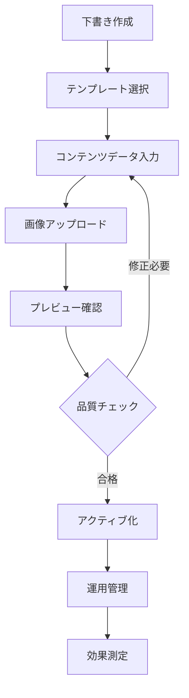
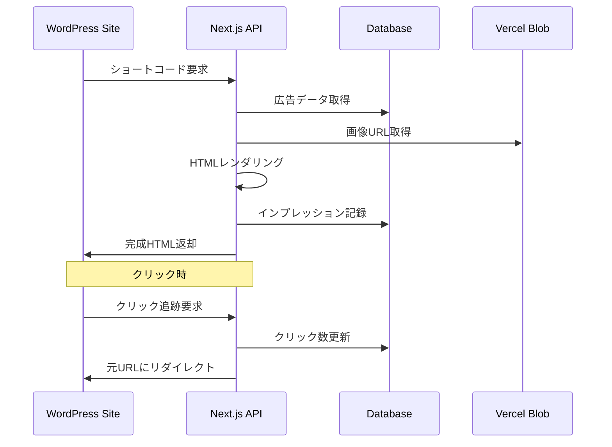

# 広告管理・配信システム

> **関連資料
**: [API仕様書](../api-reference.md) | [アーキテクチャ設計](../architecture.md) | [WordPress統合](./wordpress-integration.md)

## 広告コンテンツ管理システム

### 概要

テンプレート、URLテンプレート、画像を組み合わせた完全な広告インスタンスを作成・管理するシステムです。

### 主要機能

- **画像アップロード**: Vercel Blobを使用したドラッグ&ドロップ対応
- **ステータス管理**: 下書き・アクティブ・一時停止・アーカイブの4段階ワークフロー
- **プレビュー機能**: テンプレートとコンテンツデータを組み合わせたリアルタイムプレビュー
- **プレースホルダー対応**: テンプレートの変数と画像・コンテンツの動的結合
- **URLテンプレート連携**: トラッキングURL生成とアナリティクス統合

### 広告コンテンツワークフロー



### ステータス管理

| ステータス     | 説明      | 表示 | 編集 |
|-----------|---------|----|----|
| **下書き**   | 作成中・未公開 | ×  | ○  |
| **アクティブ** | 公開中・配信中 | ○  | ○  |
| **一時停止**  | 一時的な非表示 | ×  | ○  |
| **アーカイブ** | 運用終了・保存 | ×  | ×  |

## 広告配信システム

### 概要

WordPress統合による外部サイト向けの広告配信システム。ショートコード `[lmg_ad id="123"]` による簡単な埋め込みが可能です。

### 主要機能

- **WordPress連携**: ショートコードによる簡単な広告埋め込み
- **CORS対応配信**: 外部サイト向けの広告HTML配信
- **インプレッション追跡**: 広告表示時の自動カウント
- **クリック追跡**: 透過的なリダイレクト機能
- **キャッシュ最適化**: 多層キャッシュによるパフォーマンス向上

### 配信フロー



### WordPress統合

#### ショートコード例

```php
// 基本形
[lmg_ad id="123"]

// カスタムスタイル付き
[lmg_ad id="123" class="my-custom-ad" width="300px" height="250px"]

// キャッシュ時間指定
[lmg_ad id="123" cache="7200"]

// デバッグモード
[lmg_ad id="123" debug="true"]
```

#### 属性オプション

| 属性       | 説明         | デフォルト値             |
|----------|------------|--------------------|
| `id`     | 広告ID（必須）   | -                  |
| `cache`  | キャッシュ時間（秒） | 3600               |
| `class`  | 追加CSSクラス   | `lmg-ad-container` |
| `width`  | 幅指定        | -                  |
| `height` | 高さ指定       | -                  |
| `debug`  | デバッグモード    | false              |

## アナリティクス・追跡システム

### 概要

広告の効果測定とパフォーマンス分析を行うシステムです。

### 追跡データ

- **インプレッション追跡**: 広告表示回数の自動カウント
- **クリック追跡**: 外部リンクのクリック数測定
- **最終アクセス**: 最後に表示された日時の記録
- **アクセス元**: リファラー情報とページURL

### 効果測定指標

| 指標           | 説明        | 計算方法                     |
|--------------|-----------|--------------------------|
| **インプレッション** | 広告表示回数    | 配信APIアクセス数               |
| **クリック数**    | リンククリック回数 | 追跡URL経由アクセス数             |
| **CTR**      | クリック率     | (クリック数 ÷ インプレッション) × 100 |
| **アクティブ期間**  | 運用日数      | 現在日 - 作成日                |

## 画像管理・クリーンアップシステム

### 概要

広告画像の効率的な管理と自動クリーンアップを行うシステムです。

### 主要機能

- **自動削除**: 広告コンテンツ削除時の関連画像連鎖削除
- **孤立画像検出**: 参照されなくなった画像の自動検出
- **定期クリーンアップ**: Vercel Cron Jobsによる週次実行
- **使用状況追跡**: 画像とコンテンツの関連付け管理

### クリーンアップ対象

1. **孤立した画像**: 削除されたコンテンツに紐づく画像
2. **古い下書き画像**: 30日以上下書き状態の未使用画像
3. **重複画像**: 同一ファイルの重複インスタンス
4. **破損画像**: アクセスできない・読み込みエラーの画像

### 自動実行スケジュール

- **実行頻度**: 毎週日曜日 2:00 AM UTC
- **実行方法**: Vercel Cron Jobs
- **エンドポイント**: `/api/admin/cleanup-images`
- **認証**: `CRON_SECRET` 環境変数による認証

> **🔧 詳細な技術実装**: システムアーキテクチャは [アーキテクチャ設計](../architecture.md) を参照  
> **📊 API仕様**: 広告配信・管理のエンドポイントは [API仕様書](../api-reference.md) を参照  
> **🔗 WordPress連携**: プラグイン実装方法は [WordPress統合](./wordpress-integration.md) を参照
