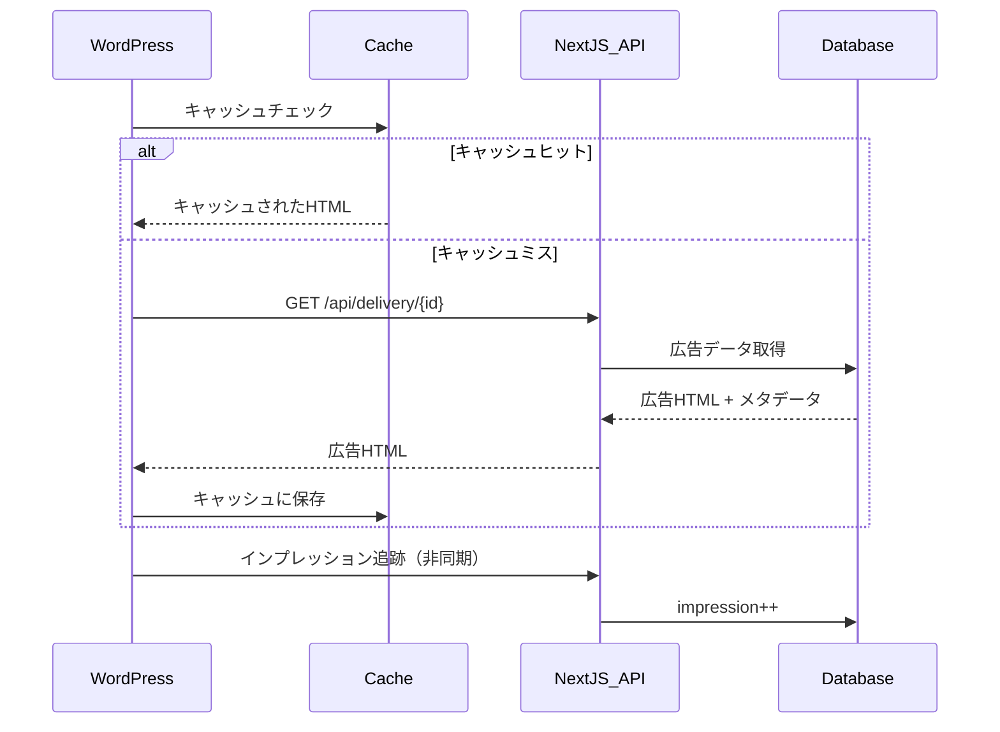
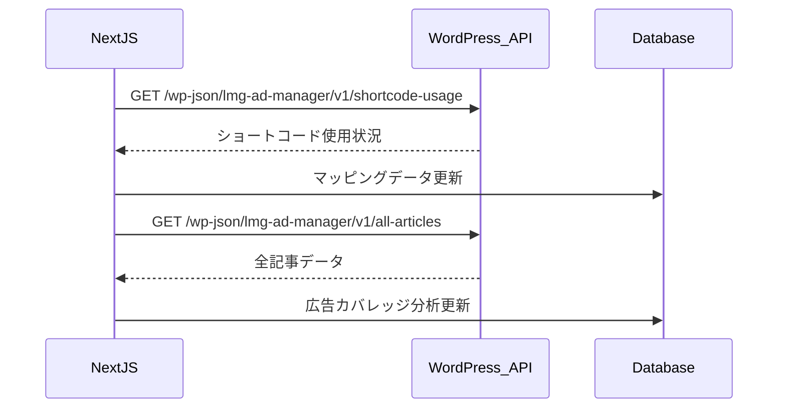

# WordPress統合システム

## アーキテクチャ概要

LMG広告管理システムは、WordPress側に**LMG Ad Manager**プラグインを実装することで完全なエンタープライズレベルの統合を実現しています。この統合により、記事ライターは
`[lmg_ad id="123"]`の簡単なショートコードで高度な広告配信とトラッキングを利用できます。

## WordPress プラグイン アーキテクチャ

### 1. メインプラグインクラス (`LMG_Ad_Manager`)

**シングルトンパターン実装**で全体の初期化を担当：

- **自動ロード**: 必要なクラスファイルの動的読み込み
- **フック管理**: WordPressアクション・フィルターの一元登録
- **アセット管理**: CSS/JavaScript の条件付き読み込み
- **ライフサイクル管理**: 有効化・無効化時の処理

### 2. ショートコード処理システム (`LMG_Ad_Shortcode`)

**高度な機能を持つショートコード処理エンジン**：

#### サポート属性

```php
[lmg_ad id="123" cache="3600" class="custom-ad" width="300px" height="250px" debug="true"]
```

| 属性       | 説明         | デフォルト値             | 例                    |
|----------|------------|--------------------|----------------------|
| `id`     | 広告ID（必須）   | -                  | `id="123"`           |
| `cache`  | キャッシュ時間（秒） | 3600               | `cache="7200"`       |
| `class`  | 追加CSSクラス   | `lmg-ad-container` | `class="sidebar-ad"` |
| `width`  | 幅指定        | -                  | `width="300px"`      |
| `height` | 高さ指定       | -                  | `height="250px"`     |
| `debug`  | デバッグモード    | false              | `debug="true"`       |

#### セキュリティ機能

- **HTMLサニタイゼーション**: `wp_kses()` による安全なHTML出力
- **属性バリデーション**: 全入力値の検証とエスケープ処理
- **権限ベースエラー表示**: 管理者にのみエラーメッセージを表示
- **XSS対策**: 出力時の適切なエスケープ処理

### 3. API通信クライアント (`LMG_Ad_API_Client`)

**堅牢なHTTP通信処理**を実装：

#### 主要機能

- **エラーハンドリング**: 包括的なエラー分類と処理
- **タイムアウト管理**: 設定可能なタイムアウト時間
- **リトライ機能**: 一時的な障害に対する自動復旧
- **デバッグログ**: 詳細なAPI通信ログ

#### APIエンドポイント

```php
// 広告データ取得
$api_client = new LMG_Ad_API_Client();
$ad_data = $api_client->get_ad_data('123');

// インプレッション追跡
$api_client->send_impression('123', [
    'page_url' => get_permalink(),
    'referrer' => $_SERVER['HTTP_REFERER'] ?? ''
]);
```

### 4. 高性能キャッシュシステム (`LMG_Ad_Cache`)

**WordPress Transients API**を活用した高性能キャッシュ：

#### 主要機能

- **インテリジェントキャッシュ**: アクセス頻度に基づく最適化
- **自動クリーンアップ**: 期限切れキャッシュの定期削除
- **統計情報**: キャッシュヒット率・サイズ・使用状況の監視
- **デバッグサポート**: 詳細なキャッシュ動作ログ

#### 使用例

```php
// キャッシュに保存
LMG_Ad_Cache::set('123', $ad_html, 3600);

// キャッシュから取得
$cached_html = LMG_Ad_Cache::get('123');

// 統計情報取得
$stats = LMG_Ad_Cache::get_cache_stats();
/*
Array(
    'total_count' => 150,
    'valid_count' => 120,
    'expired_count' => 30,
    'total_size_mb' => 2.4
)
*/
```

### 5. REST API エンドポイント (`LMG_Ad_REST_API`)

**WordPress ⇔ Next.js間のデータ連携**を実現する2つの重要なAPIを提供：

#### A) ショートコード使用状況API

**エンドポイント**: `GET /wp-json/lmg-ad-manager/v1/shortcode-usage`

**機能**: 全WordPress投稿を解析してショートコード使用状況を抽出

**レスポンス例**:

```json
{
  "shortcodes": [
    {
      "ad_id": "123",
      "count": 8,
      "posts": [
        {
          "id": 456,
          "title": "記事タイトル",
          "url": "https://example.com/post/456"
        }
      ]
    }
  ]
}
```

#### B) 全記事取得API

**エンドポイント**: `GET /wp-json/lmg-ad-manager/v1/all-articles`

**パラメータ**:

- `page`: ページ番号（デフォルト: 1）
- `per_page`: 1ページあたりの記事数（最大100、デフォルト: 100）

**レスポンス例**:

```json
{
  "articles": [
    {
      "id": "789",
      "title": "記事タイトル",
      "url": "https://example.com/article",
      "published_at": "2025-08-25",
      "category": "ニュース",
      "has_ad": true,
      "ad_ids": ["123", "456"]
    }
  ],
  "total": 500,
  "page": 1,
  "per_page": 100
}
```

## 広告配信フロー

### 1. 広告表示プロセス



### 2. 統計データ同期プロセス



## パフォーマンス最適化

### 1. キャッシュ戦略

**多層キャッシュアーキテクチャ**:

- **L1キャッシュ**: WordPress Transients（1時間デフォルト）
- **L2キャッシュ**: Next.js側CDNキャッシュ（5分）
- **L3キャッシュ**: ブラウザキャッシュ（クライアント側）

### 2. 非同期処理

```php
// インプレッション追跡（非ブロッキング）
wp_remote_post($api_endpoint, [
    'timeout' => 1,
    'blocking' => false, // 重要: 非同期実行
    'body' => json_encode($tracking_data)
]);
```

### 3. データベース最適化

- **インデックス最適化**: 頻繁にクエリされるカラムにインデックス
- **バッチ処理**: 大量データ処理時のメモリ効率化
- **接続プーリング**: データベース接続の再利用

## セキュリティ実装

### 1. 入力値検証

```php
// 広告ID検証
$ad_id = sanitize_text_field($_POST['ad_id'] ?? '');
if (!preg_match('/^[a-zA-Z0-9_-]+$/', $ad_id)) {
    wp_die('無効な広告IDです。');
}

// HTML出力時のサニタイゼーション
$safe_html = wp_kses($ad_html, [
    'div' => ['class' => [], 'id' => [], 'style' => []],
    'img' => ['src' => [], 'alt' => [], 'class' => []],
    'a' => ['href' => [], 'target' => [], 'rel' => []]
]);
```

### 2. CSRF対策

```php
// Ajax通信でのNonce検証
if (!wp_verify_nonce($_POST['nonce'], 'lmg_ad_click_nonce')) {
    wp_die('セキュリティチェックに失敗しました。');
}
```

### 3. IPアドレス取得の多層防御

```php
private function get_client_ip() {
    $ip_fields = [
        'HTTP_CF_CONNECTING_IP',    // Cloudflare
        'HTTP_X_FORWARDED_FOR',     // プロキシ経由
        'HTTP_X_REAL_IP',          // Nginx
        'REMOTE_ADDR'              // デフォルト
    ];
    
    foreach ($ip_fields as $field) {
        if (!empty($_SERVER[$field])) {
            $ip = trim(explode(',', $_SERVER[$field])[0]);
            if (filter_var($ip, FILTER_VALIDATE_IP, FILTER_FLAG_NO_PRIV_RANGE)) {
                return $ip;
            }
        }
    }
    return '127.0.0.1';
}
```

## エラーハンドリング

### 1. API通信エラー

```php
try {
    $response = $this->make_request($api_url);
    if (wp_remote_retrieve_response_code($response) === 404) {
        throw new Exception('指定された広告が見つかりません。');
    }
} catch (Exception $e) {
    error_log('LMG Ad Manager Error: ' . $e->getMessage());
    return current_user_can('manage_options') 
        ? '<!-- エラー: ' . $e->getMessage() . ' -->' 
        : '';
}
```

### 2. キャッシュフォールバック

```php
// キャッシュエラー時のフォールバック
$cached_data = LMG_Ad_Cache::get($ad_id);
if ($cached_data === false) {
    // APIから直接取得を試行
    $fresh_data = $this->fetch_from_api($ad_id);
    if ($fresh_data) {
        LMG_Ad_Cache::set($ad_id, $fresh_data, 300); // 短時間キャッシュ
        return $fresh_data;
    }
}
```

## 監視・ログシステム

### 1. 構造化ログ

```php
if ($this->debug_mode) {
    error_log('LMG Ad Manager: ' . json_encode([
        'action' => 'api_request',
        'ad_id' => $ad_id,
        'url' => $api_url,
        'response_time' => $response_time,
        'cache_hit' => $cache_hit
    ]));
}
```

### 2. パフォーマンス監視

```php
$start_time = microtime(true);
// 処理実行
$end_time = microtime(true);
$execution_time = round(($end_time - $start_time) * 1000, 2);

if ($execution_time > 1000) { // 1秒以上の場合
    error_log("LMG Ad Manager: Slow query detected - {$execution_time}ms");
}
```

## Next.js側の統合機能

記事と広告の自動紐付け管理のためのNext.js統合システム：

- **WordPress同期**: `src/lib/wordpress-sync-actions.ts` - カスタムAPIエンドポイント経由でのWordPressサイトからのマッピングデータ取得用サーバーアクション
- **マッピング管理**: `ArticleAdMappingClient.tsx` - リアルタイムデータ同期と使用統計を備えたメインインターフェース
- **データ可視化**: `MappingsTable.tsx` - 投稿-広告関係の表示、`UsageStatsCard.tsx` - 使用アナリティクスの表示
- **同期機能**: `SyncButton.tsx` - 進捗フィードバック付きの手動WordPress データ同期のトリガー
- **データエクスポート**: `ExportButtons.tsx` - 分析用のマッピングデータのCSVエクスポート機能
- **広告なし記事追跡**: `ArticlesWithoutAdsTable.tsx` - フィルタリングとソート機能付きの関連広告を持たないWordPress記事の表示
- **強化された使用統計**: より良いデータ可視化のための広告名と強化されたUIを含む使用統計
- **データベース統合**: `article_ad_mappings` テーブル - WordPress投稿関係と広告ID、同期タイムスタンプを保存
- **認証**: 管理者と編集者の役割により同期操作とマッピングデータ表示が可能

## 技術的特徴

### 高可用性

- **AbortSignal対応**: 30秒タイムアウト設定によるAPIリクエスト制御
- **グレースフルデグラデーション**: API障害時のフォールバック機能
- **自動復旧**: 一時的な障害からの自動復旧メカニズム

### 拡張性

- **モジュラー設計**: 各コンポーネントの独立性と再利用性
- **プラガブルアーキテクチャ**: 新機能の容易な追加
- **設定ドリブン**: コードを変更せずに動作をカスタマイズ

### 保守性

- **包括的なエラー処理**: 詳細なエラー分類とログ出力
- **デバッグ機能**: 本番環境での問題調査支援
- **権限管理**: 管理者・編集者権限でのデータ同期・閲覧制御
