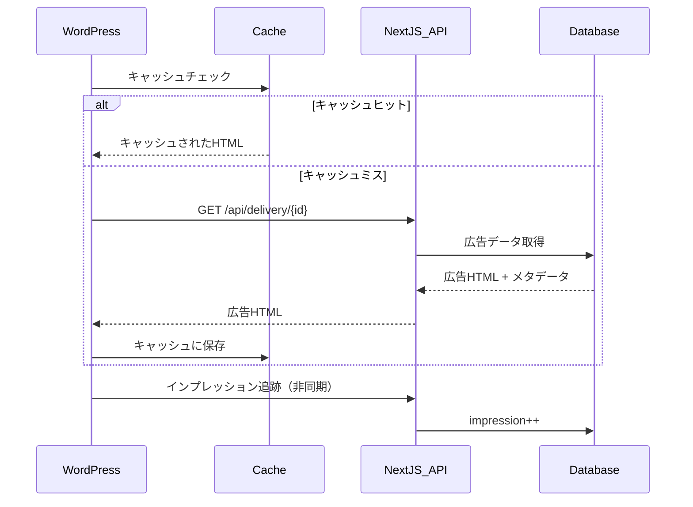

# WordPress統合システム

> **📋 このドキュメントについて**  
> **対象読者**: システム設計者、アーキテクト、統合担当者  
> **役割**: Next.js ⇔ WordPress統合システムの全体設計とアーキテクチャ  
> **関連資料
**: [WordPress プラグイン実装ガイド](../wordpress-plugin-implementation.md) | [API仕様書](../api-reference.md)

## システム概要

LMG広告管理システムは、WordPress側に**LMG Ad Manager**プラグインを実装することで完全なエンタープライズレベルの統合を実現しています。この統合により、記事ライターは
`[lmg_ad id="123"]`の簡単なショートコードで高度な広告配信とトラッキングを利用できます。

## 主要機能

### 1. WordPress プラグインシステム

- **ショートコード処理**: `[lmg_ad id="123"]` による簡単な広告埋め込み
- **高性能キャッシュ**: WordPress Transients APIを活用した多層キャッシュ
- **セキュリティ対応**: HTMLサニタイゼーション、CSRF対策、XSS防御
- **REST API**: 統計データ連携用のカスタムエンドポイント

### 2. 広告配信システム

- **CORS対応配信**: 外部サイト向けの広告HTML配信
- **インプレッション追跡**: 広告表示時の自動カウント
- **クリック追跡**: 透過的なリダイレクト機能
- **パフォーマンス最適化**: 5分間CDNキャッシュ

### 3. データ連携システム

- **統計データ同期**: WordPressサイトからのショートコード使用状況取得
- **記事データ連携**: 全記事情報の効率的な取得とマッピング
- **リアルタイム監視**: 広告カバレッジと使用状況のリアルタイム分析

## 広告配信フロー

## Next.js側の統合機能

### 記事広告マッピング管理

- **WordPress同期**: `src/lib/wordpress-sync-actions.ts`によるデータ取得
- **マッピング管理**: `ArticleAdMappingClient.tsx`でのリアルタイム管理
- **データ可視化**: 使用統計とカバレッジ分析の表示
- **CSVエクスポート**: 分析用データの書き出し機能

### データベース統合

- `article_ad_mappings` テーブルでのWordPress投稿関係管理
- リアルタイム同期とタイムスタンプ追跡
- 管理者・編集者権限による操作制御

## 技術的特徴

### パフォーマンス最適化

- **多層キャッシュ**: WordPress Transients + Next.js CDN + ブラウザ
- **非同期処理**: インプレッション追跡の非ブロッキング実行
- **データベース最適化**: インデックス最適化とバッチ処理

### セキュリティ

- **入力値検証**: 全パラメータのサニタイゼーション
- **CSRF対策**: Nonce検証による不正リクエスト防止
- **XSS防御**: wp_kses()による安全なHTML出力

### 高可用性

- **エラーハンドリング**: 包括的なエラー分類と処理
- **フォールバック機能**: API障害時の代替処理
- **自動復旧**: 一時的な障害からの自動復旧

> **🔧 詳細な実装方法**:
> PHPコード例とセットアップガイドは [WordPress プラグイン実装ガイド](../wordpress-plugin-implementation.md) を参照  
> **📊 API仕様**: エンドポイントの詳細は [API仕様書](../api-reference.md) を参照
